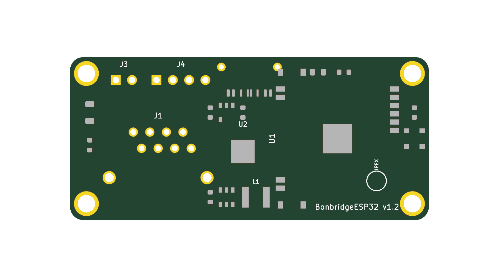
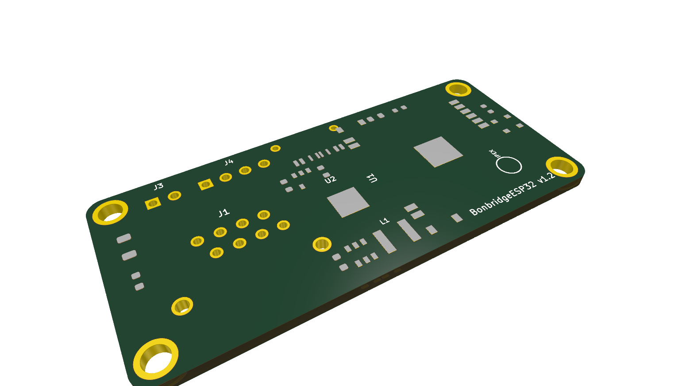
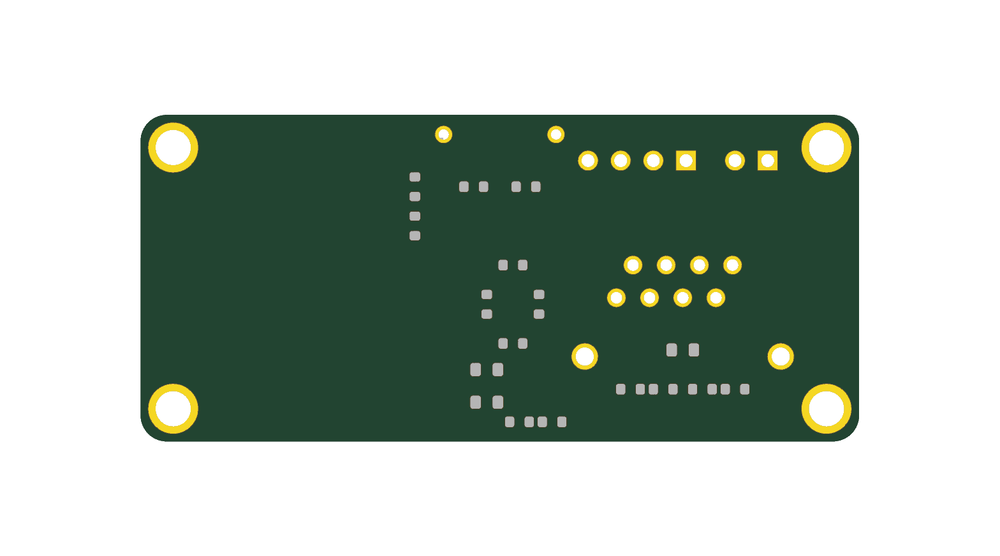

# BonbridgeESP32 - Eigene Hardware-Entwicklung (KiCad)

Vollständige Anleitung und Projektdaten für eine maßgeschneiderte All-in-One-Platine für den Festeinbau in den **Epson TM-T88 Bondrucker**.

---

## 1. Spezifikationen & Mechanik

* **Abmessungen:** Exakt **55,0 mm × 25,0 mm** (mit abgerundeten Ecken  = 2,0\text{ mm}$).
* **Befestigung:** 4× M2,5-Montagebohrungen (Bohrung 2,7 mm, Kupfer-Pad 3,8 mm, mit Masse/GND verbunden).
* **Ausrichtung & Platzierung der Anschlüsse:**
  * **Untere Längsseite (55 mm Kante):**
    * **RJ45 MagJack (J1):** Netzwerkbuchse (10/100Mbit mit Übertragern & LEDs). **Ragt 3,0 mm über den unteren Rand der Platine hinaus** (Vorderkante bei  = 128,0\text{ mm}$), damit die Buchse bündig durch einen Gehäuseausschnitt geführt werden kann.
  * **Obere Längsseite (55 mm Kante):**
    * **JST-XH 2-Pin (J3, oben links):** 24V Stromeingang vom internen Druckernetzteil (+24V, GND).
    * **JST-XH 4-Pin (J4, direkt neben J3):** 4-Pin USB-Verbindung zum Drucker-Mainboard (+5V, D-, D+, GND).
    * **USB-C Buchse (J2, gegenüber RJ45):** Zum Programmieren/Flashen und Diagnose (öffnet nach oben).
* **Externe Antenne:** Anschluss über integrierte **U.FL / IPEX Buchse** direkt auf dem ESP32-S3-WROOM-1U Modul (liegt frei zugänglich an der rechten Platinenkante).
* **DRC-Status:** **0 Fehler, 0 Warnungen** im KiCad 10 Design Rule Check!

---

## 2. Platinen-Vorschau (3D-Render & Layout)

*Draufsicht (Top-Layer F.Cu) des fertig bestückten Platinen-Layouts (55 × 25 mm)*

*3D-Isometrie-Ansicht mit 3 mm Überhang der RJ45-Buchse nach unten*

*Rückseite (Bottom-Layer B.Cu) mit EMV-optimierter Entkoppelung und Ethernet-Terminierung*

`	ext
       ┌─── 55 mm Längsseite (Oben) ──────────────────────────────────────┐
       │ (H1)  [J3] 24V    [J4] PRINTER USB     [J2] PROG  ┌───────────┐  │
       │ M2.5  [+24V G]    [+5V D- D+ GND]      USB-C      │           │  │
       │                                        [U4] 3.3V  │           │  │
       │ ┌────────────────┐                     ┌───────┐  │ ESP32-S3  │  │ (H2)
       │ │                │                     │ W5500 │  │ WROOM-1U  │  │ M2.5
       │ │  RJ45 MagJack  │                     │ QFN48 │  │           │  │
       │ │  (10/100Mbit)  │                     └───────┘  │   [IPEX]  │ [D1]
       │ │                │                     [U3]Buck   │   Ant.    │ RGB
       │ └────────────────┘                     [L1]4.7uH  └───────────┘  │
       │ (H3)                                                        (H4) │
       │ M2.5                                                        M2.5 │
       └───┬────────────┬─────────────────────────────────────────────────┘
           │  RJ45 3mm  │ ◄─── Ragt 3,0 mm über den Rand (für Gehäuseausschnitt)
           └────────────┘
`

---

## 3. Bauteilauswahl & Vollständige Stückliste (BOM)

| Ref | Komponente / Wert | Gehäuse | Ebene | Funktion & Begründung |
|---|---|---|---|---|
| **U1** | **ESP32-S3-WROOM-1U-N16R8** | SMD (18×19,2 mm) | F.Cu | **Mit U.FL/IPEX-Buchse für externe Antenne.** Spart 6 mm Baulänge gegenüber der PCB-Antennen-Version! |
| **U2** | **WIZnet W5500** | QFN-48 (7×7 mm) | F.Cu | Hardware-TCP/IP-Chip. Wird über SPI mit dem ESP32 verbunden. |
| **J1** | **RJ45 MagJack (10/100M)** | THT | F.Cu | Buchse mit integrierten Übertragern & LEDs (Amphenol RJMG1BD3B8K1ANR). **Ragt 3 mm über Rand.** |
| **J2** | **USB-C Receptacle** | SMD (TYPE-C-31-M-12) | F.Cu | Auf oberer Längsseite gegenüber RJ45. Zum Programmieren und Flashen. |
| **J3** | **JST-XH 2-Pin (2,50 mm)** | THT vertikal | F.Cu | 24V-Stromeingang vom internen Druckernetzteil (+24V, GND). |
| **J4** | **JST-XH 4-Pin (2,50 mm)** | THT vertikal | F.Cu | 4-Pin USB-Verbindung direkt zum Drucker-Mainboard (+5V, D-, D+, GND). |
| **U3** | **TI TPS54302** | SOT-23-6 | F.Cu | Abwärtsregler (Buck): Wandelt 24V DC hocheffizient auf 5,0V (bis 3A) für Drucker-USB und 3.3V-LDO. |
| **L1** | **4,7 µH (Bourns SRN4018)** | SMD (4×4 mm) | F.Cu | Speicherdrossel für den TPS54302 Step-Down-Wandler. |
| **U4** | **Diodes AP2112K-3.3** | SOT-23-5 | F.Cu | Ultra-Low-Noise LDO: Erzeugt saubere 3,3V (bis 600 mA) für ESP32-S3 und W5500. |
| **D1** | **WS2812B RGB Status-LED** | SMD PLCC4 | F.Cu | Adressierbare Smart-RGB-LED an GPIO 48 an der rechten Außenkante. |
| **SW1**| **Reset-Taster (SKRK)** | SMD 3×4 mm | F.Cu | Manueller EN/Reset-Taster (obere Kante). |
| **SW2**| **Boot-Taster (SKRK)** | SMD 3×4 mm | F.Cu | GPIO 0 Boot-Modus-Taster (untere Kante). |
| **C1** | **10 µF / 50V** | 1206 SMD | F.Cu | 24V Eingangs-Glättungskondensator. |
| **C2** | **100 nF / 50V** | 0603 SMD | F.Cu | 24V Hochfrequenz-Filter. |
| **C3** | **100 nF** | 0603 SMD | F.Cu | Bootstrap-Kondensator für TPS54302 (Pins BOOT zu SW). |
| **C4, C5** | **22 µF / 10V (2×)** | 0805 SMD | B.Cu | 5V Ausgangs-Glättungskondensatoren (direkt unter Induktivität L1). |
| **R1** | **100 kΩ (1%)** | 0603 SMD | B.Cu | Feedback-Spannungsteiler R_top für 5,0V Ausgang. |
| **R2** | **13,3 kΩ (1%)** | 0603 SMD | B.Cu | Feedback-Spannungsteiler R_bottom für 5,0V Ausgang. |
| **C6** | **4,7 µF** | 0603 SMD | F.Cu | LDO Eingangs-Kondensator (+5V). |
| **C7** | **4,7 µF** | 0603 SMD | F.Cu | LDO Ausgangs-Kondensator (+3,3V). |
| **R11, R12** | **5,1 kΩ (2×)** | 0603 SMD | B.Cu | USB-C CC1 / CC2 Pull-Down Widerstände für 5V-Aushandlung. |
| **R3** | **12,4 kΩ (1%)** | 0603 SMD | B.Cu | W5500 PHY BIAS-Referenzwiderstand nach GND. |
| **R4** | **10 kΩ** | 0603 SMD | B.Cu | W5500 Reset Pull-Up Widerstand nach +3,3V. |
| **C10, C11**| **100 nF (2×)** | 0603 SMD | B.Cu | W5500 Entkopplungskondensatoren (direkt an Versorgungs-Vias). |
| **R5, R6** | **49,9 Ω (1%) (2×)** | 0603 SMD | B.Cu | RJ45 Ethernet TX+ / TX- Leitungsabschluss. |
| **R7, R8** | **49,9 Ω (1%) (2×)** | 0603 SMD | B.Cu | RJ45 Ethernet RX+ / RX- Leitungsabschluss. |
| **C14**| **10 nF / 2 kV** | 0805 SMD | B.Cu | Bob-Smith Hochspannungs-Abschlusskondensator für LAN-Übertrager. |
| **C15**| **10 µF** | 0805 SMD | F.Cu | ESP32-S3 3,3V Bulk-Pufferkondensator. |
| **C16**| **100 nF** | 0603 SMD | F.Cu | ESP32-S3 Hochfrequenz-Entkopplung. |
| **R13**| **10 kΩ** | 0603 SMD | B.Cu | ESP32-S3 EN (Reset) Pull-Up nach +3,3V. |
| **C17**| **1 µF** | 0603 SMD | B.Cu | ESP32-S3 EN RC-Verzögerungsglied für zuverlässigen Power-On Reset. |
| **C18**| **100 nF** | 0603 SMD | F.Cu | WS2812B RGB-LED Pufferkondensator. |

---

## 4. Verdrahtungs- & Pinbelegung

### 4.1 ESP32-S3 zu W5500 (SPI-Schnittstelle)
* GPIO 10 ➔ W5500 SCLK (Takt)
* GPIO 11 ➔ W5500 MOSI (Daten zum Chip)
* GPIO 12 ➔ W5500 MISO (Daten vom Chip)
* GPIO 9  ➔ W5500 CS (Chip Select)
* GPIO 14 ➔ W5500 INT (Interrupt)
* GPIO 13 ➔ W5500 RST (Hardware-Reset)

### 4.2 ESP32-S3 zum Drucker-Mainboard (JST-XH 4-Pin - J4)
* Pin 1 ➔ +5,0V (Ausgang vom Step-Down-Wandler)
* Pin 2 ➔ GPIO 19 (USB D-)
* Pin 3 ➔ GPIO 20 (USB D+)
* Pin 4 ➔ GND (Gemeinsame Masse)

### 4.3 USB-C Programmierbuchse (J2)
* A6 / B6 (D+) ➔ GPIO 20
* A7 / B7 (D-) ➔ GPIO 19
* CC1 ➔ 5,1 kΩ Widerstand nach GND
* CC2 ➔ 5,1 kΩ Widerstand nach GND
* VBUS ➔ Anode von Schottky-Diode D2 ➔ Kathode an +5V-Schiene

### 4.4 Status-LED
* GPIO 48 ➔ DIN der WS2812B RGB-LED

---

## 5. Das KiCad-Projekt verwenden

Die Projektdateien befinden sich direkt in diesem Ordner:
* **BonbridgeESP32_CustomBoard.kicad_pro**: KiCad Projektdatei mit konfigurierten Fertigungsregeln.
* **BonbridgeESP32_CustomBoard.kicad_pcb**: Vollständig bestücktes und DRC-verifiziertes Board-Layout (55×25 mm, 0 Fehler). Getestet und nativ kompatibel mit KiCad 10.0!
* **generate_kicad_project.py**: Python-Generatorskript, das das gesamte Board inklusive aller Bauteile, Netzlisten und Geometrien automatisiert generiert.
* **drc_report.txt**: Offizieller DRC-Prüfbericht (0 Fehler / 0 Warnungen).

### Lagenaufbau (Stackup-Empfehlung):
* **4-Lagen-Platine (1,6 mm Dicke, z. B. JLCPCB JLC04161H-7628):**
  * *Lage 1 (F.Cu - Top):* Signale & Hauptkomponenten (ESP32, W5500, Buchsen, Induktivität)
  * *Lage 2 (In1.Cu):* Durchgehende GND-Massefläche für minimale Störstrahlung und optimalen Rückstrom
  * *Lage 3 (In2.Cu):* Power-Planes für +5,0V und +3,3V
  * *Lage 4 (B.Cu - Bottom):* Entkopplungskondensatoren, Terminierungswiderstände & Masse
